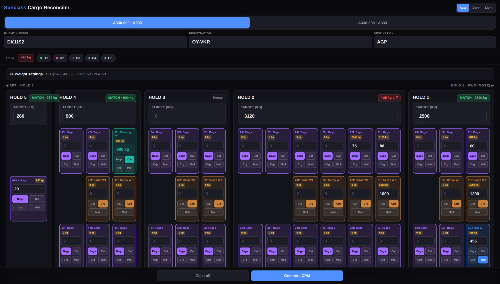
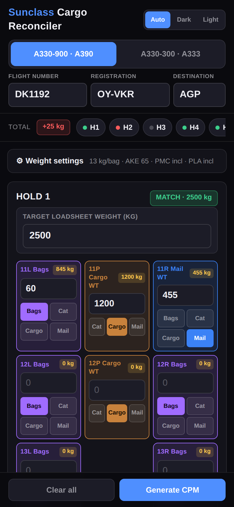
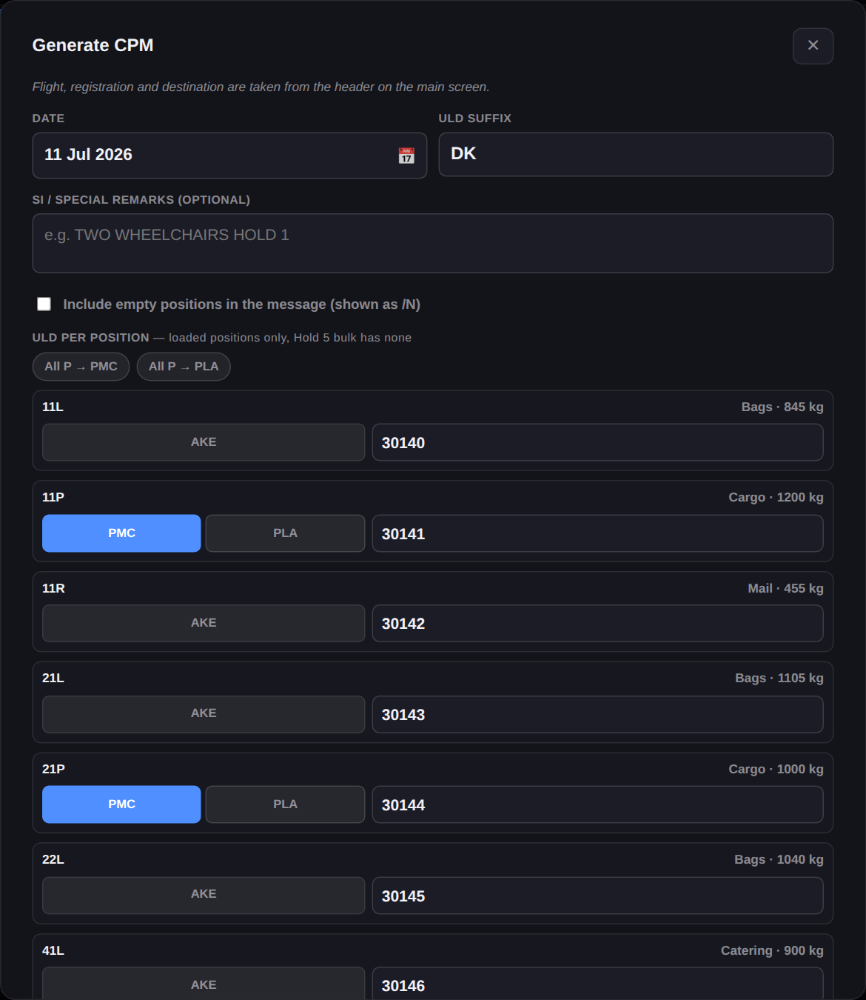
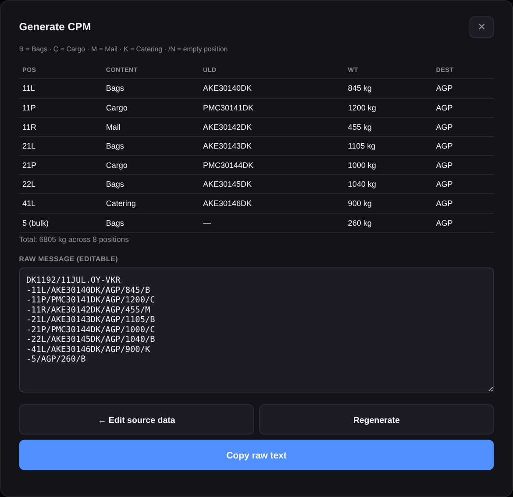
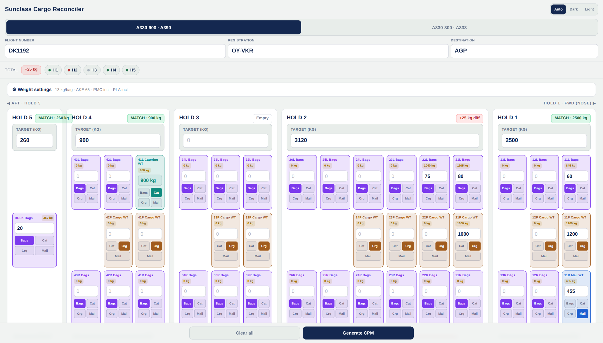

# ✈️ Sunclass Cargo Reconciler

A single-file web app for ground operations: reconcile per-position hold weights against the loadsheet, then generate a **CPM** (Container/Pallet distribution Message) from the same data — built for the A330-900 (A390) and A330-300 (A333).

**No installs, no dependencies, no backend.** One `index.html`, runs in any browser — phone at the gate or ultrawide in the office.

> 🔗 **Live:** [kungkotz.github.io/cpmbuddy](https://kungkotz.github.io/cpmbuddy/)


*On wide screens the layout **is** the aircraft, nose to the right: holds run 5 → 1 left-to-right, sections run aft → forward inside each hold, L/P/R stack vertically, and the bulk compartment sits alone on the pallet row like the tail.*

---

## What it does

1. **Reconcile** — type what's loaded in each hold position; the app sums it and compares against the loadsheet target. Green badge = match, red = diff, per hold and grand total.
2. **Generate a CPM** — once the numbers are right, one tap produces the message with ULD IDs, destination, weights and content codes, as both a readable table and an editable raw teletype string you can copy or share.

## Features

- 📱 **Mobile-first & responsive** — stacked hold cards on phones, full side-profile aircraft layout on desktops/ultrawides (≥1500 px)
- 🌗 **Auto / Dark / Light theme** — follows the device by default, manual override remembered
- 🧮 **Smart weight math**
  - **Bags** are typed as a *count*: `count × bag weight + container weight` (AKE on L/R, PMC/PLA on P, nothing on BULK)
  - **Cargo / Mail** are typed as *weight*; by default the container is considered included in your number — untick per pallet type in settings to have the app add it on top
  - **Catering** positions auto-fill from whatever remains to hit the hold target (splits across multiple catering positions, remainder-exact)
- ⚙️ **Configurable constants** — bag weight, AKE/PMC/PLA weights, persisted in the browser
- 🔀 **Aircraft switching** that preserves your entries — only positions that don't exist on the other type are dropped
- 🎨 **Color-coded content types** — purple Bags · brown Cargo · teal Catering · blue Mail, distinct from the green/red status colors in both themes
- 🏷️ **ULD entry with zero-tap defaults** — L/R are always AKE; P positions toggle PMC/PLA (with "All P →" quick-set); airline suffix (e.g. `DK`) appended to every ULD ID
- 📦 **Complete messages** — catering positions and the Hold 5 bulk compartment (`-5/…`, no ULD) are always in the CPM; empty positions can optionally be listed as `/N`
- ✅ **Guard rails** — flight/reg/dest validated before the CPM opens (missing fields highlighted), warning if positions lack ULD numbers
- 📤 **Copy or native Share** of the raw message; the text stays hand-editable

## Screenshots

| Mobile | CPM window | Generated CPM |
|---|---|---|
|  |  |  |

**Light mode:**



---

## Quick guide

*(A printable 2-page PDF version lives in [`docs/Sunclass_Reconciler_QuickGuide.pdf`](docs/Sunclass_Reconciler_QuickGuide.pdf).)*

### 1 · Set up the flight
Pick the **aircraft** (A390 / A333) first — it changes the hold layout. Fill **Flight number**, **Registration** (with or without the dash: `OY-VKR` or `OYVKR`) and **Destination**. All three are required before a CPM can be generated; missing ones flash red.

### 2 · Weight settings (set once)
Open **⚙ Weight settings**. Bag weight and container weights live here and are remembered. The two tick-boxes control Cargo/Mail on pallet positions: ticked (normal) means the container weight is included in the number you type; unticked means the app adds it on top.

### 3 · Fill each hold
Type the hold's **target loadsheet weight**, then per position pick what it holds and type the number:

| Mode | You type | The app does |
|---|---|---|
| **Bags** | number of bags | × bag weight + container weight |
| **Cargo** | weight in kg | as typed (or + container if unticked) |
| **Mail** | weight in kg | same as Cargo |
| **Cat** | nothing | auto-filled from the remaining target |

Make every hold badge **green**, then hit **Generate CPM**.

### 4 · Generate, edit, share
Fill in the date (defaults to today), the **ULD suffix** (`DK`), optional SI remarks, and a ULD number per position — types are automatic (L/R = AKE, P = PMC or PLA; Hold 5 bulk needs no ULD). Tick **Include empty positions** if you want unloaded positions listed as `/N`. The result shows a readable table plus the raw message:

```
DK1192/11JUL.OY-VKR
-11L/AKE30142DK/AGP/845/B
-11P/PMC30143DK/AGP/1200/C
-12L/AKE30144DK/AGP/455/K
-5/AGP/260/B
-13L/N
SI TWO WHEELCHAIRS HOLD 1
```

`B` bags · `C` cargo · `M` mail · `K` catering · `-5/…` the bulk compartment · `/N` empty position.

Edit the text directly if needed, then **Copy** or **Share**. **Clear all** wipes everything for the next flight (settings and theme are kept).

> ⚠️ **Note:** the output is a correctly-structured *working* CPM for checking and pasting into your handling system — it does not include the routing/addressing header a live teletype transmission needs. Always send through the normal channel.

---

## Tech notes

- **Single file.** All HTML, CSS and JS in `index.html` — fork it, open it, done. Works offline once loaded; add it to your phone's home screen for an app-like experience.
- **No frameworks, no build step, no network calls.** Vanilla JS, CSS Grid, CSS custom properties.
- **Persistence** via `localStorage`: weight settings and theme choice only. Flight data intentionally lives in memory and resets on refresh.
- **Theming**: one palette per mode defined as CSS variables, switched by `prefers-color-scheme` with a manual `.theme-dark` / `.theme-light` override.
- **The aircraft layout** is pure CSS Grid: hold-card column widths are proportional to section counts (`--hold-cols` set from JS), sections map to reversed grid columns (`--sec`), and L/P/R are three shared equal rows so every hold's pallet row aligns — including the lone BULK tile.

## Related projects

- [**TCOBuddy**](https://github.com/kungkotz/tcobuddy) — gate-level delay & turnaround calculator PWA
- [**PayBuddy**](https://github.com/kungkotz/pay-buddy) — payroll calculator for Aviator ground staff
- [**ICS Converter**](https://github.com/kungkotz/ics-converter) — Altéa roster → `.ics` calendar converter

## Disclaimer

Unofficial personal tool. Not affiliated with Sunclass Airlines or Aviator. Always verify weights and messages against your certified systems — the loadsheet is the authority, this is the sanity check.
