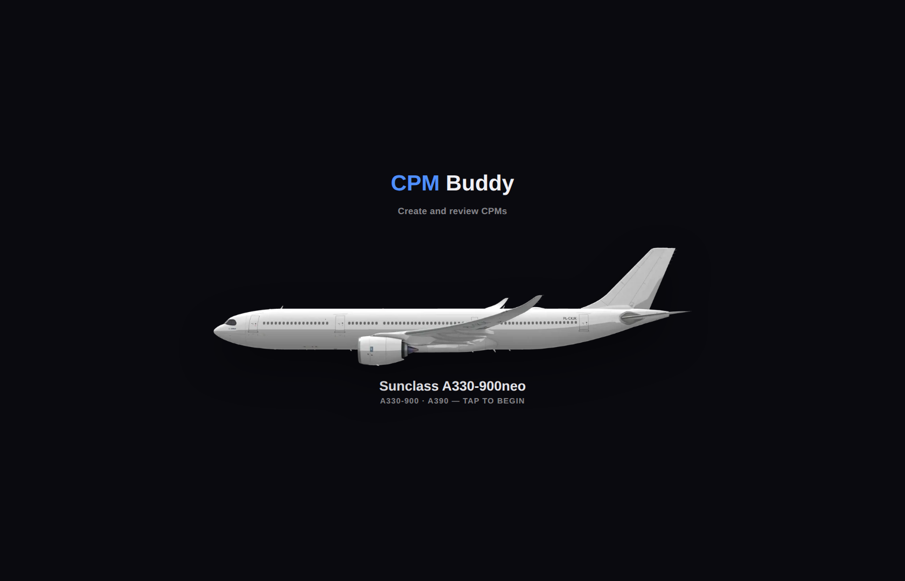
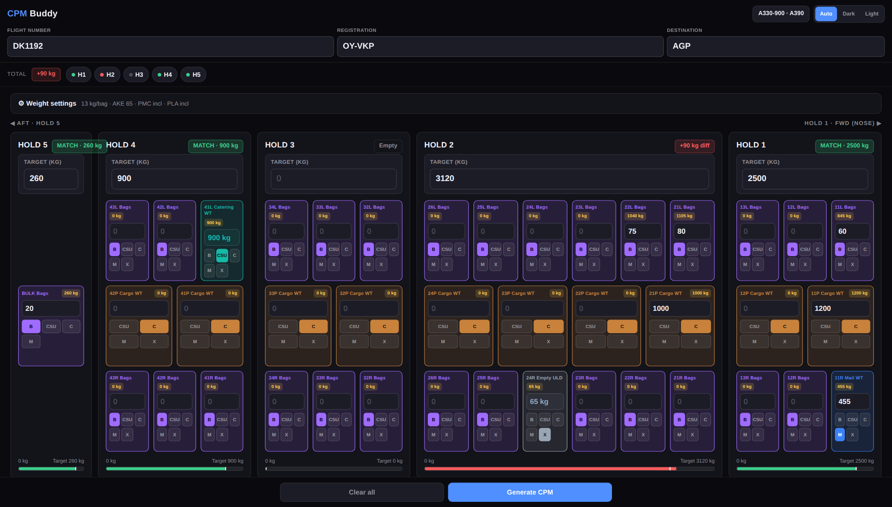
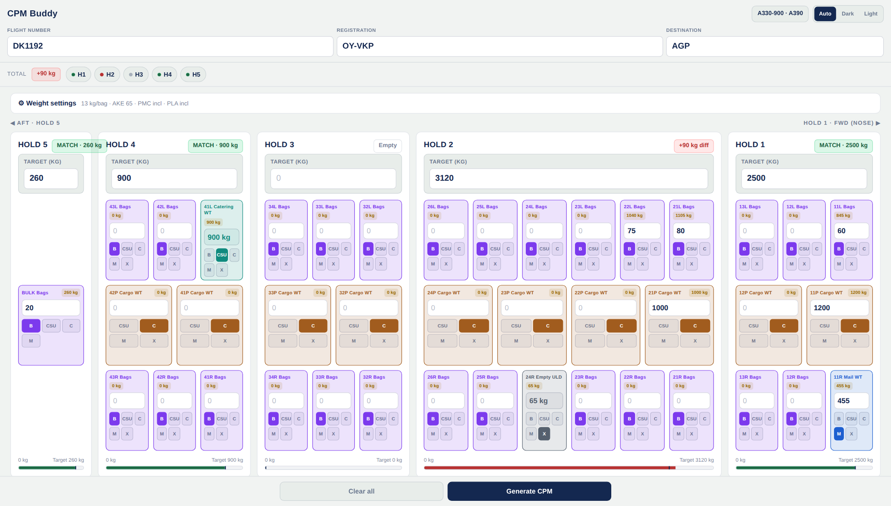
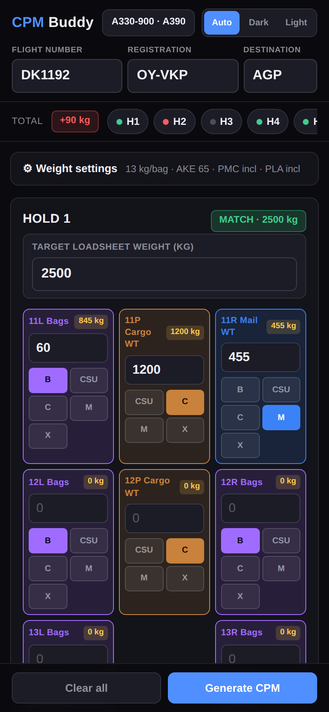
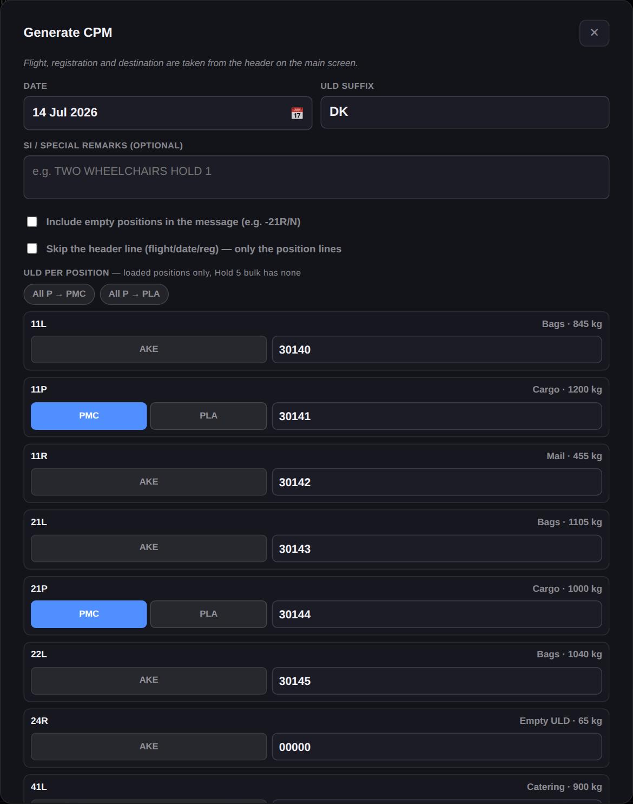
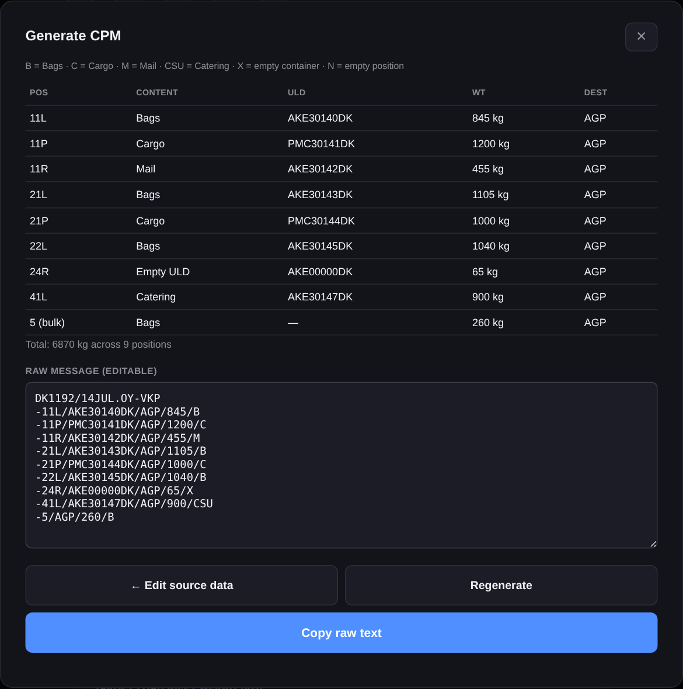

# ✈️ CPM Buddy

**Create and review CPMs** — a single-file web app for ground operations at Copenhagen Airport. Reconcile hold weights against the loadsheet, then generate a Container/Pallet distribution Message ready to copy and paste.

No installs, no dependencies, no backend. One `index.html`, runs in any browser.

> 🔗 **Live:** [kungkotz.github.io/cpmbuddy](https://kungkotz.github.io/cpmbuddy/)



---

## The aircraft view

On wide screens (24" monitors, ultrawides) the layout **is** the aircraft — nose to the right, holds 5→1 left to right, sections aft→forward, L/P/R stacked vertically. Pallet bays tile the full hold length, just like real PMC footprints.





On phones it stacks into a scrollable card layout — same data, same logic, smaller screen.

| Mobile | CPM form | Generated CPM |
|---|---|---|
|  |  |  |

---

## Features

- 📱 **Mobile-first & responsive** — stacked cards on phones, full aircraft side-profile on desktops (≥1500 px)
- 🌗 **Auto / Dark / Light** theme, remembered between sessions
- 🧮 **Weight modes per position**
  - **B** (Bags) — type a count → count × bag weight + container
  - **C** (Cargo) / **M** (Mail) — type a weight in kg
  - **CSU** (Catering) — auto-fills from the remaining target
  - **X** (Empty container) — auto-computed tare, generates e.g. `-24R/AKE00000DK/CPH/65/X`
- ⚙️ **Settings** — bag weight, AKE/PMC/PLA weights, per-pallet "container included" toggles. Set once, remembered.
- 🎨 **Color-coded** — purple bags, brown cargo, teal catering, blue mail, slate empty — distinct from the green/red status badges in both themes
- 📦 **PMC footprint awareness** — a loaded PMC blocks its neighboring L/R positions; the wide layout draws pallet bays at their real 1.5-section width
- 🏷️ **ULD entry** — L/R always AKE; P toggles PMC/PLA (with "All P →" quick-set); airline suffix appended automatically
- ✅ **Validation** — popup alert if flight/reg/dest are missing; red highlight + scroll; warning on blank ULD numbers
- 📤 **Copy or Share** the raw message; text stays hand-editable

## CPM output

```
DK1192/14JUL.OY-VKP
-11L/AKE30142DK/AGP/845/B
-11P/PMC30143DK/AGP/1200/C
-11R/AKE30144DK/AGP/455/M
-41L/AKE30145DK/AGP/900/CSU
-5/AGP/260/B
```

- Header: `FLIGHT/DATE.REG` — or skip it (checkbox) for systems that prepend their own
- Hold 5 bulk always included as `-5/DEST/WT/CODE` (no ULD)
- Catering always included (code CSU)
- Empty positions optionally listed as `-POS/N`, coverage-aware: pallet bays describe the space, no redundant L/R lines
- Empty containers: `-POS/ULD/DEST/tare/X`
- SI remarks at the end if provided

---

## Quick guide

**1 · Tap the aircraft** on the home screen to enter.

**2 · Fill flight details** — Flight number, Registration (with or without dash), Destination.

**3 · Weight settings** (set once) — open ⚙, set bag weight and container weights. The PMC/PLA checkboxes control whether typed Cargo/Mail weights include the pallet or not (ticked = included, the normal way).

**4 · Fill each hold** — type the target, then per position pick a mode and enter the value:

| Button | You type | The app does |
|---|---|---|
| **B** | number of bags | × bag weight + container |
| **C** | weight in kg | as typed (or + pallet if unticked) |
| **M** | weight in kg | same as Cargo |
| **CSU** | nothing | auto-filled from remaining target |
| **X** | nothing | auto-computed container tare |

**5 · Make every hold green**, then tap **Generate CPM**.

**6 · Fill ULD details** — date, suffix (DK), ULD numbers. Generate → Copy or Share.

**7 · Clear all** for the next flight. Settings and theme are kept.

> A printable PDF guide is in [`docs/CPMBuddy_Guide.pdf`](docs/CPMBuddy_Guide.pdf).

---

## Tech

Single file, vanilla JS, CSS Grid, no frameworks, no build step, no network calls. Settings stored in `localStorage`; flight data lives in memory and resets on refresh. The aircraft layout uses proportional grid columns, subcolumn spans for pallet bays, and three equal rows so the P row aligns across every hold including the bulk tail.

## Disclaimer

Unofficial personal tool, not affiliated with Sunclass Airlines or Aviator Airport Alliance. The output is a correctly structured working CPM for checking and pasting — always verify against your certified systems.
